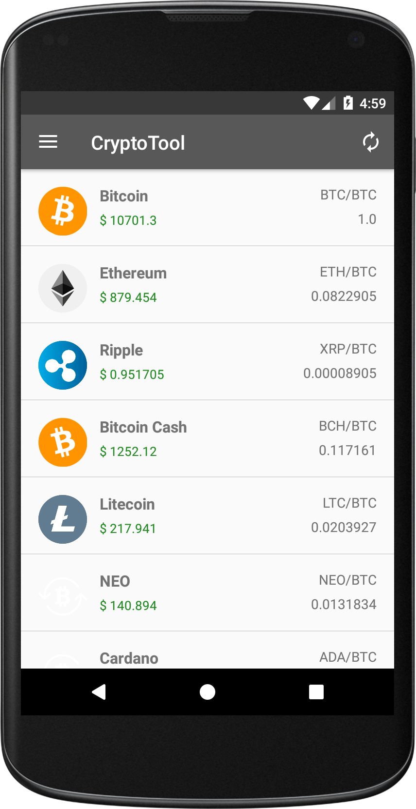
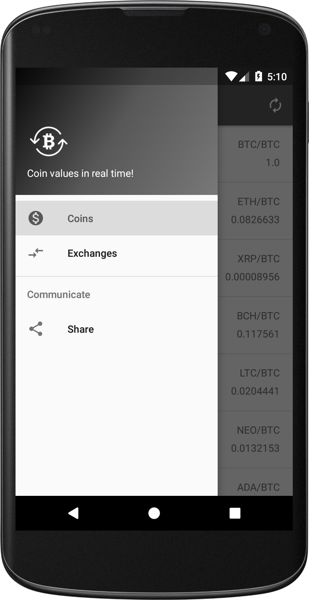
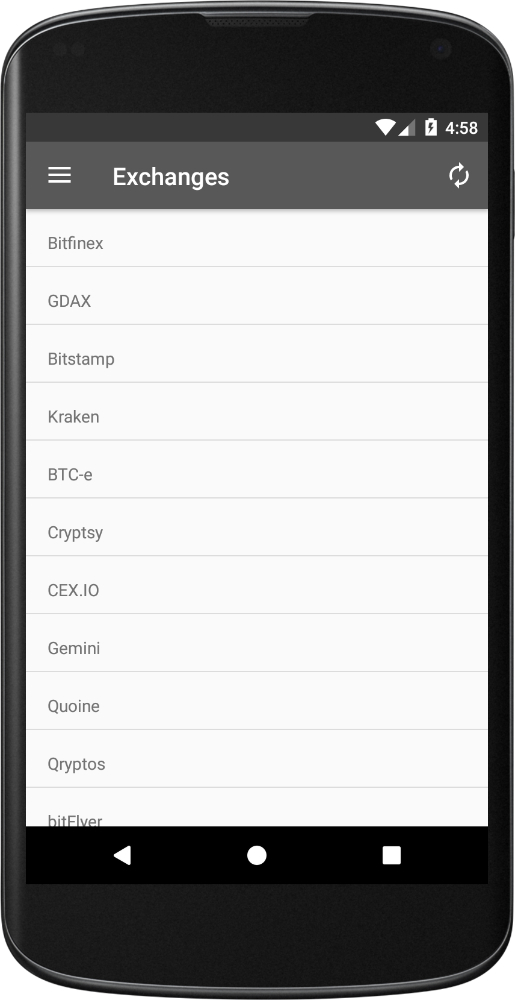
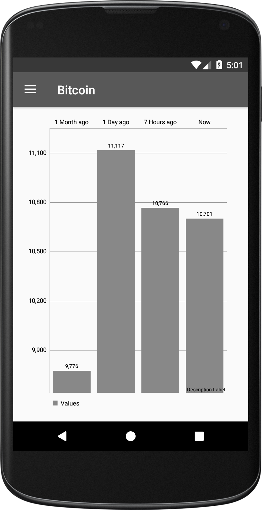

# CryptoTool
CryptoTool is an application developed in kotlin that allows you to see in real time the latest values of the most popular cryptocurrencies

## Features
* List of the most popular coins
* Graph with the last values of a specific coin
* List of different  exchanges

## Captures

## Third Party Libraries
* [RxJava](https://github.com/ReactiveX/RxJava)
* [Dagger2](https://google.github.io/dagger/)
* [Retrofit 2](http://square.github.io/retrofit/)
* [OkHttp3](https://github.com/square/okhttp)
* [Picasso](https://github.com/square/picasso)
* [MPAndroidChart](https://github.com/PhilJay/MPAndroidChart)

